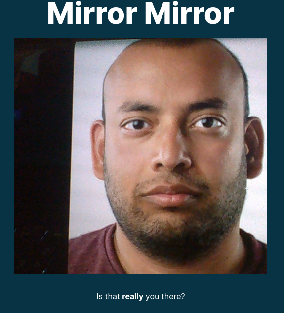

# Mirror

An Angular application using OpenAI to generate AI versions of images taken with the webcam.

## Requirements

* OpenAI API Key
  * Add this to the [environment](/src/environments) file.

| Webcam Shot | Example Generated by AI |
|-------------| --- |
|  |  |
